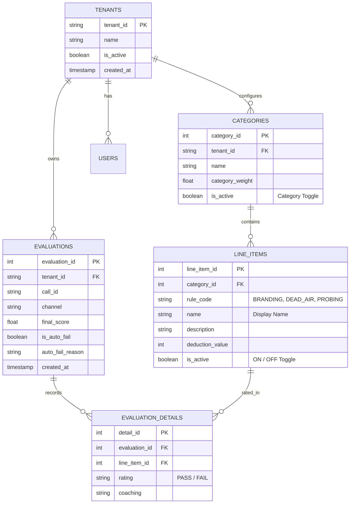

# System Architecture & Technical Specifications

This document provides a comprehensive technical specification of the **Automated QA Analysis System**. It details the end-to-end execution lifecycle, dynamic multi-tenant criteria selection, deterministic rule algorithms, local LLM integration, and mathematical scoring normalization.

---

## 1. Master Pipeline Architecture

The system evaluates customer support interactions using a **Hybrid Deterministic + Local LLM Architecture**. By offloading exact mathematical SLA calculations and verbatim checks to Python rules and vector similarity, the system minimizes local LLM inference latency, saves tokens, and eliminates hallucinations.


---

## 2. Dynamic Multi-Tenant Criteria Engine

### 2.1 Dynamic Criteria Selection (`selected_criteria`)
In traditional engines, all criteria are statically evaluated. If a tenant or request omits a criterion, a static engine might evaluate it anyway and unfairly deduct marks.

In this system:
1. All line items inside the tenant's categories are extracted into a normalized lowercase Python `set`:
   ```python
   selected_criteria = {
       item.get("name", "").strip().lower()
       for cat in categories
       for item in cat.get("line_items", [])
   }
   ```
2. Each rule evaluation runs **if and only if** its identifier exists in `selected_criteria`:
   ```python
   if "branding and survey check" in selected_criteria:
       rule_ratings.append(evaluate_branding(turns))

   if "hold time and dead air" in selected_criteria:
       rule_ratings.append(evaluate_hold_and_dead_air(turns, parsed_times))

   if "verified customer" in selected_criteria:
       rule_ratings.append(evaluate_verified_customer(turns, parsed_times))
   ```
3. **Benefit:** Unselected criteria are skipped entirely. No LLM tokens are consumed, execution latency drops, and agents receive zero unfair deductions.

---

### 2.2 Dynamic Category Weight Normalization (`calculate_category_scores`)
When a tenant disables or omits one or more categories, the remaining configured weights may not sum to $1.0$ ($100\%$). Without normalization, an agent who passes every evaluated criterion would be unfairly capped at a lower score (e.g., $70/100$).

#### Mathematical Re-Balancing Formula:
For the subset of evaluated categories $C_1, C_2, \dots, C_k$ with configured base weights $w_i$:

1. Compute Total Active Weight:
   $$W_{\text{active}} = \sum_{i=1}^{k} w_i$$

2. Calculate Normalized Weights:
   $$w_i' = \frac{w_i}{W_{\text{active}}}$$

3. Compute Re-Balanced Final Score:
   $$\text{Final Score} = \sum_{i=1}^{k} \left( \text{Score}_{C_i} \times w_i' \right)$$

This guarantees that evaluated categories scale proportionally and the final score is always normalized to $100.0\%$.

---

### 2.3 Rule-Based Distinct Pass Descriptions Injection
When an item passes, LLMs should not be invoked merely to explain why it passed (which wastes tokens and adds seconds of latency). Conversely, returning an empty coaching string (`"coaching": ""`) degrades the UI audit trail.

The engine maintains a pre-compiled mapping:
```python
RULE_BASED_PASS_DESCRIPTIONS = {
    "branding and survey check": "Agent successfully used required opening and closing branding scripts.",
    "hold time and dead air": "Agent maintained active communication without excessive dead air (>30s).",
    "personalized the call/ticket appropriately": "Agent addressed customer by their verified name during the interaction.",
    "empathy & acknowledgment statement": "Agent demonstrated appropriate empathy and acknowledgment of the customer's situation.",
    "build rapport and observed professionalism": "Agent maintained a professional, courteous, and respectful demeanor throughout.",
    "paraphrasing": "Agent accurately acknowledged and mirrored the customer's reported issue.",
    "verified customer": "Agent verified customer identity within the required time window.",
    "probing": "Agent asked effective diagnostic questions to investigate the root cause.",
    "took ownership of the problem": "Agent demonstrated clear ownership without deflecting or blaming other departments.",
    "active listening": "Agent practiced active listening without repetitive or redundant questions.",
    "confirmed the issue is resolved": "Agent explicitly confirmed that the issue was resolved before closing."
}
```
During final scorecard construction, if `rating == "PASS"`, the distinct description is injected automatically at **0 LLM token cost**.

---

## 3. The 11 QA Evaluation Criteria Breakdown

### Category 1: Soft Skills (Default Weight: 33.3%)
1. **Branding and Survey Check (`evaluate_branding`):**
   * *Deterministic Rule:* Checks first 4 agent turns for `"thank you for calling s-net"` AND last 4 turns for `"thank you for choosing s-net"`.
2. **Hold time and Dead Air (`evaluate_hold_and_dead_air`):**
   * *Deterministic Rule:* Scans turn timestamp gaps. Gaps $>30\text{s}$ are flagged. Up to 2 communicated holds tolerated; $\ge 3$ gaps triggers FAIL.
3. **Personalized the call/ticket appropriately (`evaluate_personalized_call`):**
   * *Deterministic Rule:* Checks if caller/customer name is spoken by agent during interaction.
4. **Empathy & Acknowledgment Statement (Snippet LLM):**
   * *Hybrid:* Tracks customer turn sentiment scores. If negative friction occurs, extracts the 4-turn snippet and prompts Llama for a 1-word (`PASS`/`FAIL`) verdict.
5. **Build rapport and observed professionalism (Searchlight LLM):**
   * *Violation-Based:* Scans agent lines for rude/condescending patterns (`"read the manual"`, `"calm down"`). If detected, LLM confirms violation; otherwise defaults to PASS.

### Category 2: Technical Knowledge (Default Weight: 66.7%)
6. **Paraphrasing (Vector Engine):**
   * *Vector Embedding:* Compares embeddings (`nomic-embed-text`) of first 10 customer turns against first 10 agent turns. Cosine similarity $\ge 0.50 \implies \text{PASS}$.
7. **Verified customer (`evaluate_verified_customer`):**
   * *Deterministic Rule:* Scans first 4 minutes ($240\text{s}$) for verification credentials (`PIN`, `address`, `security question`).
8. **Probing (Contextual LLM):**
   * *Hybrid:* Extracts all agent questions and evaluates against the customer's problem context. Verifies at least 1 genuine diagnostic question was asked.
9. **Took ownership of the problem (Searchlight LLM):**
   * *Violation-Based:* Deterministically scans for deflection keywords (`"not my department"`, `"call someone else"`). LLM verifies flagged snippets.
10. **Active listening (Hybrid Snippet LLM):**
    * Detects repetitive questions via embedding similarity. LLM confirms if agent repeated questions unnecessarily.
11. **Confirmed the issue is resolved (Sliced LLM):**
    * Evaluates the last 30% of the transcript turns to confirm explicit resolution prior to call wrap-up.

### Category 3: Auto-Fail Circuit Breakers
* **Profanity & Abuse:** Blacklisted profanities (`"fuck"`, `"shut up"`, `"idiot"`, etc.) trigger immediate 0 score.
* **Extreme Hostility:** 3 or more flagged harsh lines trigger immediate 0 score.
* **Scorecard Circuit Breaker:** Any Auto-Fail item rated FAIL triggers immediate 0 score with reason.

---

## 4. Database Schema Roadmap (Multi-Tenant Architecture)

To enable tenant admins to toggle criteria ON/OFF via a Web UI without sending JSON criteria in API requests, the system is designed to integrate with the following relational schema:



* **`is_active` in `LINE_ITEMS`:** Allows tenant admins to toggle individual criteria ON or OFF.
* **`rule_code` in `LINE_ITEMS`:** Decouples user-customizable display names from the underlying Python rule functions (`BRANDING`, `DEAD_AIR`, `VERIFICATION`, etc.), preventing code breaks when criteria names are edited.

---

## 5. Codebase Map & Module Reference

| File Path | Description |
|---|---|
| `main.py` | Application entry point and server bootstrap launcher (QA Service :8006). |
| `run_gateway.py` | Root launcher for the API Gateway (port 8005). |
| `src/gateway/gateway_app.py` | API Gateway reverse proxy with direct fast-path PostgreSQL routes for criteria fetch & toggle. |
| `src/api/web_app.py` | FastAPI application exposing `/api/evaluate`, `/api/preview-prompt`, criteria CRUD, and samples. |
| `src/db/database.py` | PostgreSQL data layer for tenants, categories, line items, and tenant toggle states. |
| `src/api/logger.py` | Structured JSON logger capturing request correlation IDs, client IPs, latencies, and responses. |
| `src/services/dynamic_evaluator.py` | Core evaluation orchestrator: dynamic criteria filtering, hybrid pipeline execution, scoring normalization, and pass description injection. |
| `src/services/rule_engine.py` | Deterministic Python functions for verbatim branding, dead air, verification, and snippet searchlights. |
| `src/services/llm_adapter.py` | Singleton Ollama adapter (`_adapter`) managing chat generation, embedding vector queries, and retries. |
| `resources/criteria_config.json` | Default tenant criteria configurations, deduction values, and category weights. |
| `resources/prompts/` | Prompt templates for dynamic evaluation, coaching tips, and suggestions. |
| `Scripts/batch_test.py` | Automated batch test runner evaluating sample transcripts against `/api/evaluate`. |
| `Docs/postman_collection.json` | Exported Postman API collection for testing endpoints and dynamic criteria payloads. |
